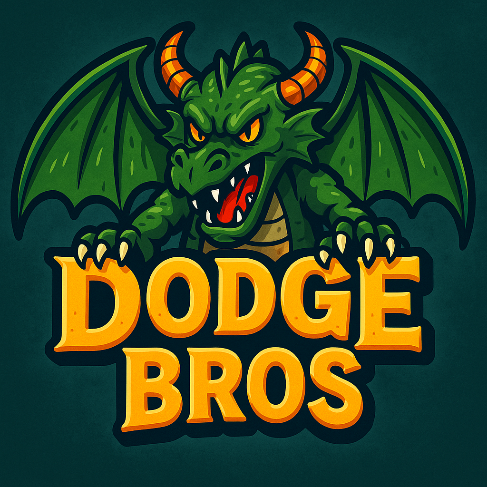

# 🎮 Dodge Bros 🐉🔥

A 2-player co-op dodge-and-slay arcade game built using Python + Pygame.  
Survive the dragon’s fireballs, collect 30 black orbs, and launch a massive counterattack!



---

## 🖼️ Gameplay Screenshot


---

## 🎯 Features

- 👬 Local 2-player keyboard controls
- 🔥 Fireballs rain from above
- 🟣 Collect 30 orbs to activate an ultimate attack
- 🐉 Huge flying dragon boss
- 🎵 Music + sound effects
- 🔁 Replay button + `R` key to restart

---

## ▶️ How to Play

- **Player 1**: `A`, `D`, `W` to move & jump
- **Player 2**: Arrow keys to move & jump
- **Press `G`** when 30 orbs are collected to launch a massive orb
- **Avoid fireballs** — you lose hearts
- **Press `R`** to replay anytime after Game Over / Victory

---

## 🐍 How to Run

### 🔹 Install Requirements
```bash
pip install -r requirements.txt
